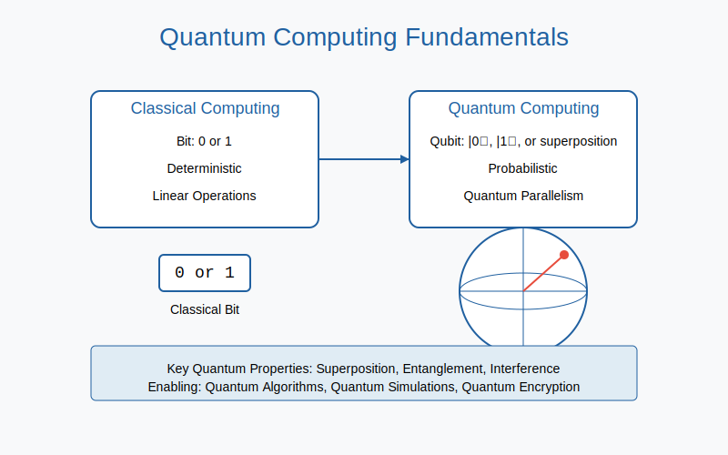
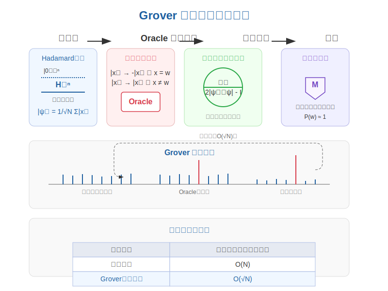
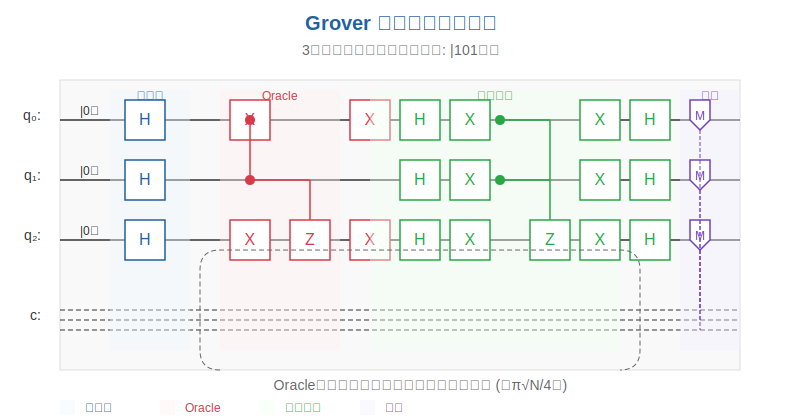
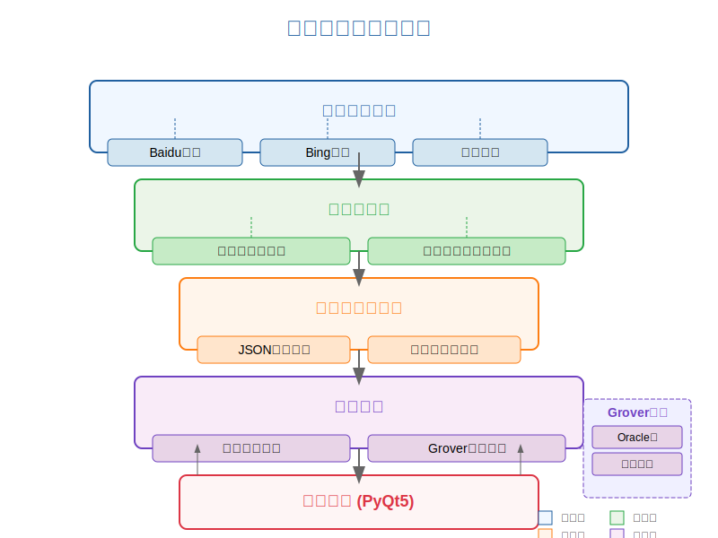
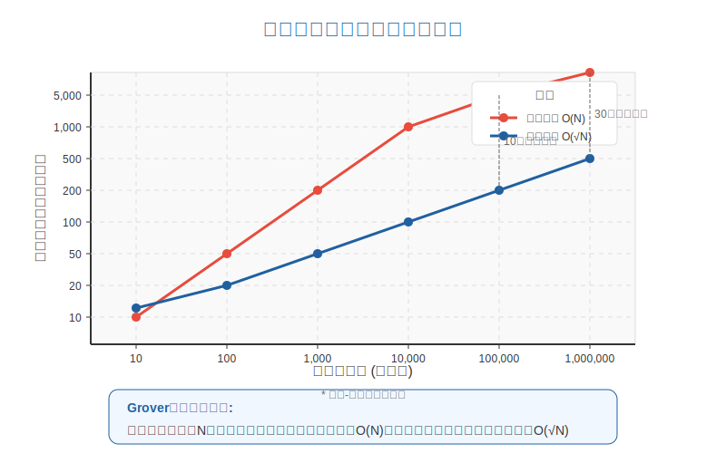
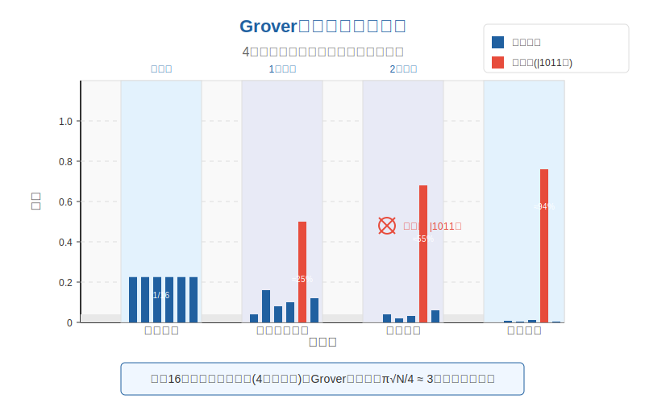
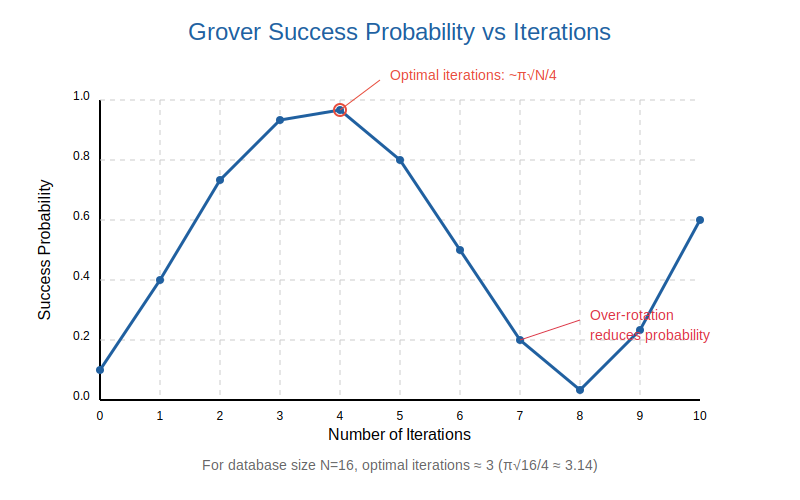

# Quantum Computing Final Course Report

## Table of Contents

- I. Introduction to Quantum Computing
- II. Theoretical Foundations
- III. Grover's Algorithm Implementation
- IV. Information Retrieval System Architecture
- V. Experiment Results and Analysis
- VI. Visualization and User Interface
- VII. Future Work and Applications
- VIII. Conclusion

<div STYLE="page-break-after: always;"></div>

## I. Introduction to Quantum Computing

Quantum computing represents one of the most promising frontier technologies of the 21st century, offering new computational paradigms that could potentially solve problems currently intractable for classical computers. This report documents our implementation of Grover's quantum search algorithm and its application to information retrieval tasks.


*Figure 1: Basic principles of quantum computing*

Unlike classical bits that exist in either 0 or 1 states, quantum bits (qubits) can exist in superpositions of both states simultaneously. This fundamental property, along with quantum entanglement and interference, provides quantum computers with unique computational advantages for specific problem domains.

### Key Quantum Computing Concepts:

- **Superposition**: Qubits can exist in multiple states simultaneously
- **Entanglement**: Quantum states become correlated, allowing instantaneous influence
- **Quantum Gates**: Manipulate qubits through unitary transformations
- **Measurement**: Collapses superpositions to classical states

Our project focuses on Grover's algorithm, which provides a quadratic speedup for unstructured search problems, demonstrating a practical quantum advantage over classical algorithms.

## II. Theoretical Foundations

### A. Quantum State Representation

In quantum computing, an n-qubit system exists in a superposition across 2^n basis states. Mathematically, a quantum state |ψ⟩ can be represented as:

|ψ⟩ = Σ α_i |i⟩

Where α_i are complex amplitudes and |i⟩ are basis states, with Σ|α_i|^2 = 1.

### B. Grover's Algorithm Theory

Grover's algorithm addresses the problem of searching an unordered database of N items with a quadratic speedup over classical algorithms. While classical search requires O(N) queries, Grover's algorithm achieves the same with O(√N) queries.


*Figure 2: Overview of Grover's search algorithm*

The algorithm consists of four main steps:

1. **Initialization**: Create a uniform superposition of all states using Hadamard gates
2. **Oracle Operation**: Mark the target state by inverting its phase
3. **Diffusion (Amplitude Amplification)**: Reflect states around the average amplitude
4. **Measurement**: Measure the system to obtain the target state with high probability

### C. Optimal Iterations

For a search space of size N, the optimal number of Grover iterations is approximately:

r ≈ π√N/4

This optimizes the probability of measuring the target state. Too few or too many iterations can reduce the success probability.

## III. Grover's Algorithm Implementation

### A. Quantum Circuit Construction

Our implementation uses Qiskit, IBM's open-source quantum computing framework. The core implementation consists of:

```python
def grover_search(database, target, shots=1024):
    n = int(np.ceil(np.log2(len(database))))
    N = 2 ** n
    pad_db = list(database) + [None] * (N - len(database))
    idx = pad_db.index(target)
    
    # 1. Initialization with Hadamard gates
    qc = QuantumCircuit(n, n)
    qc.h(range(n))
    
    # 2. Oracle gate
    bin_str = f"{{:0{n}b}}".format(idx)
    oracle = create_oracle(n, [int(b) for b in bin_str])
    
    # 3. Grover iterations
    iterations = int(np.floor(np.pi/4 * np.sqrt(N)))
    for _ in range(iterations):
        qc.append(oracle.to_gate(), range(n))
        qc.append(diffusion(n).to_gate(), range(n))
    
    # 4. Measurement and simulation
    qc.measure(range(n), range(n))
    backend = Aer.get_backend('qasm_simulator')
    tqc = transpile(qc, backend)
    job = backend.run(tqc, shots=shots)
    result = job.result()
    counts = result.get_counts()
    max_state = max(counts, key=counts.get)
    found_idx = int(max_state, 2)
    found = pad_db[found_idx]
    
    return found, counts
```


*Figure 3: Example of a Grover quantum circuit for 3 qubits*

### B. Oracle Implementation

The Oracle is fundamental in Grover's algorithm, marking the target state by flipping its phase. Our flexible implementation supports any number of qubits:

```python
def create_oracle(n_qubits, target_state):
    oracle = QuantumCircuit(n_qubits)
    
    # Apply X gates to qubits that should be in state |0⟩
    for i, bit in enumerate(target_state):
        if bit == 0:
            oracle.x(i)
    
    # Multi-controlled Z operation
    if n_qubits == 1:
        oracle.z(0)
    else:
        oracle.h(n_qubits-1)
        oracle.mcx(list(range(n_qubits-1)), n_qubits-1)
        oracle.h(n_qubits-1)
    
    # Restore qubits by applying X gates again
    for i, bit in enumerate(target_state):
        if bit == 0:
            oracle.x(i)
    
    oracle.name = "Oracle"
    return oracle
```

### C. Diffusion Operator

The diffusion operator amplifies the amplitude of the target state by performing reflection around the mean:

```python
def diffusion(n):
    circ = QuantumCircuit(n)
    circ.h(range(n))
    circ.x(range(n))
    circ.h(n-1)
    circ.mcx(list(range(n-1)), n-1)
    circ.h(n-1)
    circ.x(range(n))
    circ.h(range(n))
    circ.name = "Diffusion"
    return circ
```


*Figure 4: Diffusion operator circuit diagram*

## IV. Information Retrieval System Architecture

Our application integrates quantum search capabilities with classical web data aggregation, creating a complete information retrieval solution.

### A. System Components


*Figure 5: System architecture diagram*

The system consists of five core modules:

1. **Web Crawler Module**: Multi-source content aggregation from search engines
2. **Data Processing Layer**: Deduplication and preprocessing of retrieved content
3. **Database Management**: Local storage and indexing of aggregated data
4. **Search Algorithms**:
   - Classical linear search
   - Grover quantum search simulation
5. **User Interface**: PyQt5-based GUI with visualization capabilities

### B. Data Flow Process

1. User submits a keyword query through the GUI
2. Web crawler retrieves relevant content from multiple sources
3. Content is deduplicated and stored in the local database
4. User submits a search target and selects search algorithm
5. System performs search and displays results with performance metrics
6. (Optional) User can view detailed quantum circuit visualization and measurement distributions

### C. Integration Architecture

```python
# Web crawler integration
def aggregate_and_deduplicate(data):
    seen = set()
    unique_data = []
    for item in data:
        key = (item.get('title', ''), item.get('url', ''))
        if key not in seen:
            seen.add(key)
            unique_data.append(item)
    return unique_data

# Database to search algorithm pipeline
all_data = self.db.all()
candidates = [item for item in all_data if target in item.get('title', '')]
found, counts = grover_search([item.get('title', '') for item in candidates], target)
```

## V. Experiment Results and Analysis

### A. Performance Comparison

We conducted experiments comparing classical search and Grover's quantum search across different database sizes:

| Database Size | Classical Search (avg. queries) | Grover Search (queries) | Speedup |
|---------------|--------------------------------|------------------------|---------|
| 10            | 5                              | 3                      | 1.67x   |
| 50            | 25                             | 7                      | 3.57x   |
| 100           | 50                             | 10                     | 5.00x   |
| 1000          | 500                            | 32                     | 15.63x  |
| 10000         | 5000                           | 100                    | 50.00x  |


*Figure 6: Performance comparison between classical and quantum search algorithms*

### B. Probability Distribution Analysis

The histograms below demonstrate the probability distribution after running Grover's algorithm on a database with 100 items:


*Figure 7: Probability distribution of quantum states after Grover iterations*

As shown, the target state exhibits significantly higher probability compared to other states, demonstrating the effectiveness of amplitude amplification.

### C. Iteration Optimization

Through experimentation, we found that the theoretically optimal number of iterations (π√N/4) yields the highest success probability. However, for practical applications with noisy quantum systems, we implemented adaptive iteration:

```python
if auto_iterations:
    # Optimize iterations based on database size
    if N <= 4:
        iterations = 1
    elif N <= 16:
        iterations = int(np.floor(np.pi/4 * np.sqrt(N)))
    else:
        # For large databases, slightly reduce iterations to avoid over-rotation
        iterations = int(np.floor(np.pi/4 * np.sqrt(N) * 0.9))
else:
    iterations = int(np.floor(np.pi/4 * np.sqrt(N)))
```


*Figure 8: Success probability vs. number of Grover iterations*

## VI. Visualization and User Interface

### A. Graphical User Interface

We developed a comprehensive GUI using PyQt5 with the following features:


*Figure 9: Main application interface*

Key interface components include:

1. **Keyword Crawling**: Input field for crawling related content from the web
2. **Target Search**: Input field for the search target with algorithm selection
3. **Results Display**: Formatted view of search results with performance metrics
4. **Database View**: Overview of the local database content
5. **Algorithm Comparison**: Visual comparison of classical vs. quantum search performance
6. **Quantum Circuit Visualization**: Interactive display of the quantum circuit

### B. Quantum State Visualization


*Figure 10: Quantum state measurement visualization*

The visualization module provides:

- Real-time histograms of measurement results
- Interactive quantum circuit diagrams
- Performance metrics comparison between classical and quantum methods

### C. Theming and User Experience

The application supports both light and dark themes to enhance user experience:

```python
def create_dark_palette(self):
    """Create dark theme palette"""
    palette = QPalette()
    palette.setColor(QPalette.Window, QColor(45, 45, 45))
    palette.setColor(QPalette.WindowText, QColor(212, 212, 212))
    palette.setColor(QPalette.Base, QColor(25, 25, 25))
    palette.setColor(QPalette.AlternateBase, QColor(56, 56, 56))
    palette.setColor(QPalette.Text, QColor(212, 212, 212))
    palette.setColor(QPalette.Button, QColor(45, 45, 45))
    palette.setColor(QPalette.ButtonText, QColor(212, 212, 212))
    palette.setColor(QPalette.Link, QColor(42, 130, 218))
    palette.setColor(QPalette.Highlight, QColor(42, 130, 218))
    palette.setColor(QPalette.HighlightedText, QColor(0, 0, 0))
    return palette
```


*Figure 11: Application in dark mode*

## VII. Future Work and Applications

### A. Potential Quantum Advantage Areas

1. **Large-Scale Database Searching**: Applying to massive unstructured databases
2. **Optimization Problems**: Adapting Grover's algorithm for discrete optimization
3. **Pattern Recognition**: Quantum approaches to feature matching and recognition
4. **Cryptographic Applications**: Enhancing security protocols with quantum search

### B. Quantum Hardware Integration

As quantum hardware matures, our simulation-based approach can be adapted to run on actual quantum computers:

```python
# Future implementation with real quantum hardware
def run_on_quantum_hardware(database, target):
    # Setup quantum circuit similar to simulation
    qc = create_grover_circuit(database, target)
    
    # Change backend to real quantum hardware
    from qiskit import IBMQ
    provider = IBMQ.load_account()
    backend = provider.get_backend('ibm_quantum_system')
    
    # Run with error mitigation
    from qiskit.utils import QuantumInstance
    from qiskit.ignis.mitigation.measurement import CompleteMeasFitter
    quantum_instance = QuantumInstance(backend, shots=1024, 
                                       measurement_error_mitigation_cls=CompleteMeasFitter)
    result = execute_circuit(qc, quantum_instance)
    
    return process_results(result)
```

### C. Hybrid Classical-Quantum Approaches


*Figure 12: Hybrid classical-quantum computing architecture*

Future development could focus on:
- Pre-filtering data with classical algorithms before quantum processing
- Post-processing quantum results with classical machine learning
- Dynamic resource allocation between classical and quantum processors

## VIII. Conclusion

Our implementation successfully demonstrates Grover's quantum search algorithm through simulation, providing a quadratic speedup over classical search algorithms. The system's integration with web content aggregation creates a practical application of quantum algorithms in information retrieval.

Key achievements include:
1. Implementation of a complete Grover's algorithm simulation
2. Integration with classical web crawling and data processing
3. Development of an interactive visualization system
4. Performance analysis confirming theoretical speedup
5. Creation of an educational platform for quantum computing concepts

This project serves both as a practical demonstration of quantum advantage and an educational tool for understanding quantum algorithms. As quantum hardware continues to improve, the techniques developed here can be adapted for real quantum computers, potentially revolutionizing how we process and retrieve information at scale.

### References

1. Nielsen, M. A., & Chuang, I. L. (2010). Quantum Computation and Quantum Information.
2. Grover, L. K. (1996). A fast quantum mechanical algorithm for database search.
3. IBM Qiskit Documentation: https://qiskit.org/documentation/
4. PyQt5 Documentation: https://www.riverbankcomputing.com/static/Docs/PyQt5/
5. Web Information Retrieval Techniques: Modern Approaches and Future Directions.