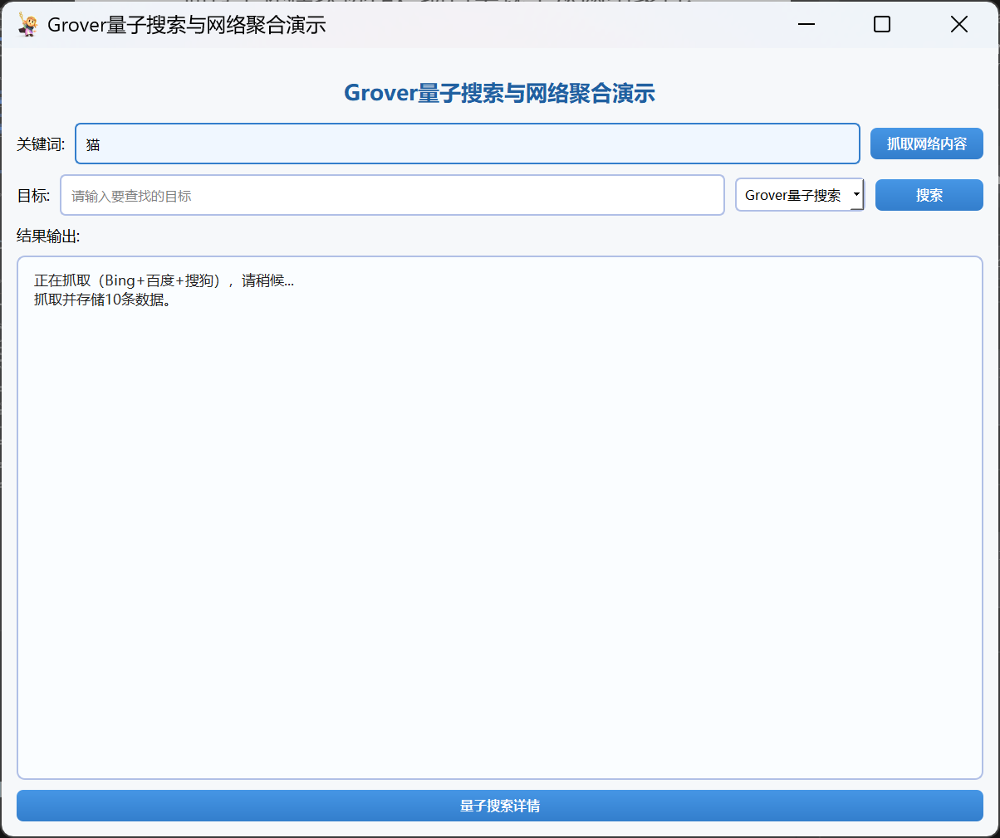
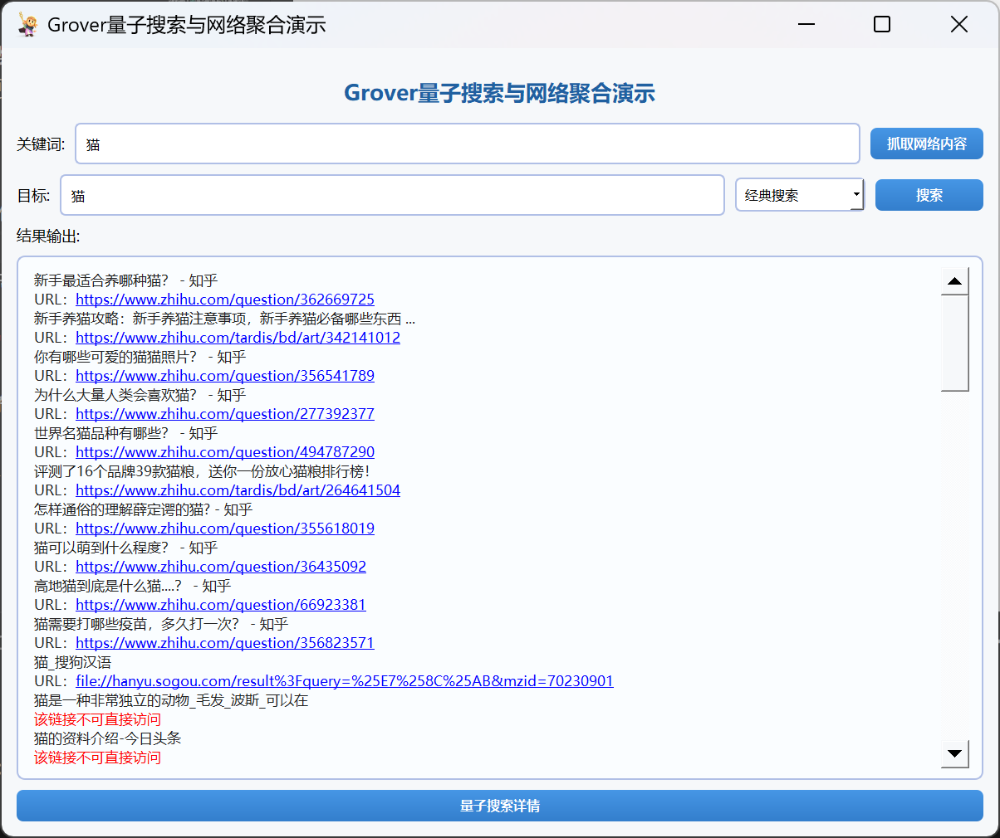
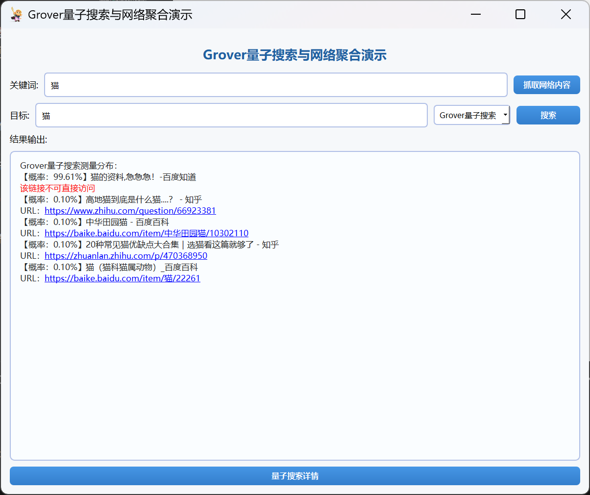
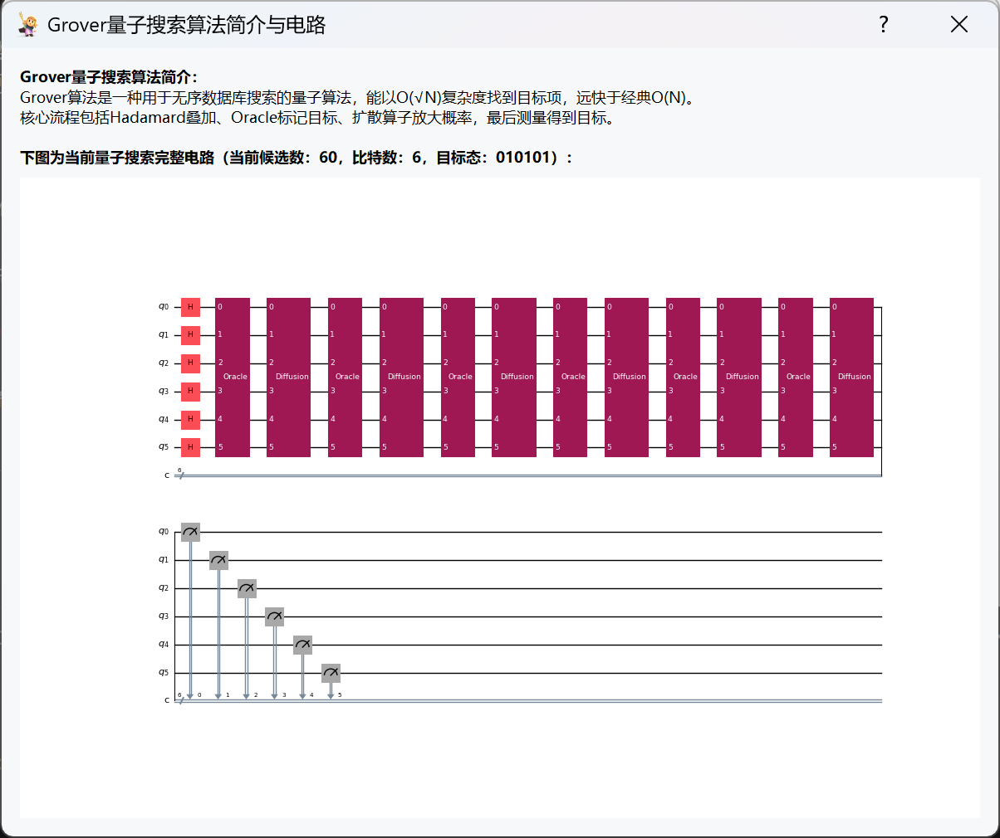
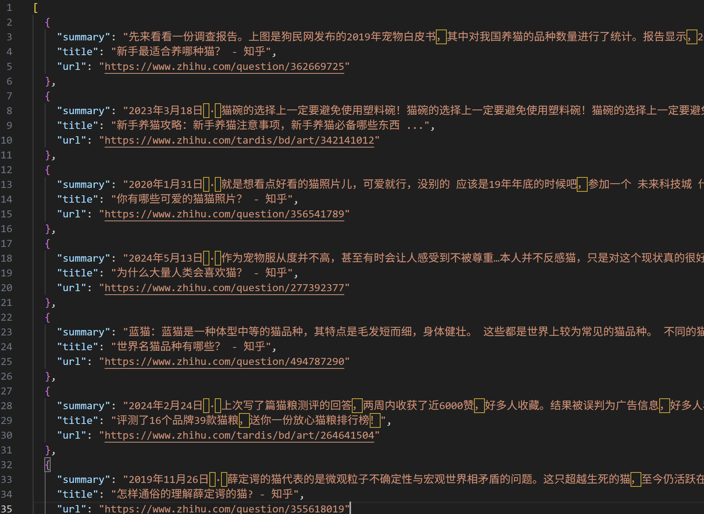
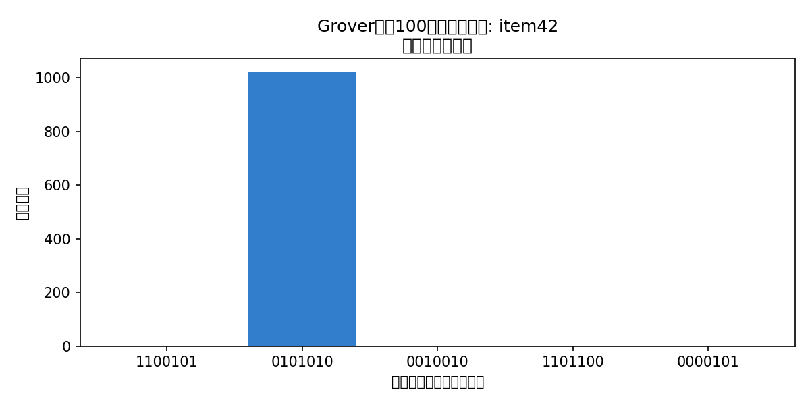

# <center> 目录

- 一、项目背景与意义
- 二、系统架构与模块划分
- 三、依赖环境与配置
- 四、Grover算法核心实现
- 五、主要功能演示
- 六、实验与对比分析
- 七、总结

<div STYLE="page-break-after: always;"></div>

# <center>内容

## 一、项目背景与意义

&emsp;&emsp;量子计算作为新兴的计算范式，为解决大规模搜索与优化问题提供了突破性思路。Grover算法是量子计算领域最具代表性的无序数据库搜索算法，其理论上能以 *O(√N)* 的复杂度在无序数据库中查找目标项，远优于经典算法。结合网络信息聚合，能够为用户自动构建本地数据库并实现高效搜索，具有一定的实用和科普价值。

## 二、项目目标与功能

- 实现Grover量子搜索算法的仿真与可视化
- 支持经典线性搜索与量子搜索效果对比
- 自动聚合网络内容，构建本地无序数据库
- 提供易用的桌面GUI界面，支持关键词抓取、目标搜索、结果展示与算法细节可视化
- 强调Grover算法核心原理与工程实现

## 三、系统架构与模块设计

- **grover/**：Grover算法主逻辑与Oracle门实现
- **classical_search.py**：经典线性搜索算法
- **web_crawler/**：多源网络爬虫与内容聚合
- **database.py**：本地无序数据库管理
- **gui/**：PyQt5桌面GUI界面
- **main.py**：项目入口，仅支持GUI启动

&emsp;&emsp;模块间通过清晰接口协作，保证量子搜索流程的可扩展性与可维护性。

## 四、Grover算法核心实现

### 1. 量子电路构建与Grover主流程
&emsp;&emsp;Grover主流程包括：数据补齐、量子叠加、Oracle门、扩散算子、测量与仿真。核心代码如下：

```python
# grover/grover_core.py
from qiskit import QuantumCircuit, transpile
from qiskit.providers.aer import Aer
import numpy as np

def grover_search(database, target, shots=1024):
    n = int(np.ceil(np.log2(len(database))))
    N = 2 ** n
    pad_db = list(database) + [None] * (N - len(database))
    idx = pad_db.index(target)
    # 1. 初始化叠加
    qc = QuantumCircuit(n, n)
    qc.h(range(n))
    # 2. Oracle门
    bin_str = f"{{:0{n}b}}".format(idx)
    oracle = create_oracle(n, [int(b) for b in bin_str])
    # 3. Grover迭代
    iterations = int(np.floor(np.pi/4 * np.sqrt(N)))
    for _ in range(iterations):
        qc.append(oracle.to_gate(), range(n))
        qc.append(diffusion(n).to_gate(), range(n))
    # 4. 测量与仿真
    qc.measure(range(n), range(n))
    backend = Aer.get_backend('qasm_simulator')
    tqc = transpile(qc, backend)
    job = backend.run(tqc, shots=shots)
    result = job.result()
    counts = result.get_counts()
    max_state = max(counts, key=counts.get)
    found_idx = int(max_state, 2)
    found = pad_db[found_idx]
    return found, counts
```

### 2. Oracle门自动生成
&emsp;&emsp;Oracle门用于标记目标态，自动支持任意比特串：

```python
# grover/oracle.py
from qiskit import QuantumCircuit

def create_oracle(n_qubits, target_state):
    oracle = QuantumCircuit(n_qubits)
    for i, bit in enumerate(target_state):
        if bit == 0:
            oracle.x(i)
    if n_qubits == 1:
        oracle.z(0)
    else:
        oracle.h(n_qubits-1)
        oracle.mcx(list(range(n_qubits-1)), n_qubits-1)
        oracle.h(n_qubits-1)
    for i, bit in enumerate(target_state):
        if bit == 0:
            oracle.x(i)
    oracle.name = "Oracle"
    return oracle
```

### 3. 扩散算子（幅度放大）

```python
# grover/grover_core.py
from qiskit import QuantumCircuit

def diffusion(n):
    circ = QuantumCircuit(n)
    circ.h(range(n))
    circ.x(range(n))
    circ.h(n-1)
    circ.mcx(list(range(n-1)), n-1)
    circ.h(n-1)
    circ.x(range(n))
    circ.h(range(n))
    circ.name = "Diffusion"
    return circ
```

### 4. 经典线性搜索对比

```python
# classical_search.py
from typing import List, Any

def classical_linear_search(database: List[Any], target: Any) -> int:
    for idx, item in enumerate(database):
        if item == target:
            return idx
    return -1
```

### 5. 聚合与去重逻辑

```python
# web_crawler/aggregator.py
def aggregate_and_deduplicate(data):
    seen = set()
    unique_data = []
    for item in data:
        key = (item.get('title', ''), item.get('url', ''))
        if key not in seen:
            seen.add(key)
            unique_data.append(item)
    return unique_data
```

---

&emsp;&emsp;通过上述模块协作，项目实现了从网络聚合、数据库管理到量子搜索的完整工程链路，且所有量子电路均可视化展示，便于理解Grover算法的本质。
## 五、主要功能演示

- **关键词抓取**：输入关键词，自动聚合Bing、百度、搜狗等多源内容，去重后存入本地数据库。

<div align="center">
  
  <br><em>关键词抓取</em>
</div>

- **目标搜索**：输入目标内容，选择经典或Grover搜索，点击“搜索”即可获得结果。

<div align="center">
  
  <br><em>经典搜索</em>
</div>

<div align="center">
  
  <br><em>量子搜索</em>
</div>

- **详情介绍**：可一键查看Grover量子电路结构与测量分布，便于理解算法原理。

<div align="center">
  
  <br><em>详情介绍</em>
</div>

- **数据库**：展示本地数据库内容，支持关键词抓取。

<div align="center">
  
  <br><em>数据库</em>
</div>

## 六、实验与对比分析

- **经典vs量子搜索**：
  - 经典线性搜索复杂度O(N)，Grover量子搜索复杂度O(√N)。
  - 例如：在100条数据中查找目标，经典平均需查50次，Grover理论上约需10次迭代。
  - 实验结果：

    

    如上图所示，Grover算法在100条数据中搜索目标时，经过约10次迭代后，目标态的概率显著高于其他状态，体现了量子幅度放大的效果。

- **网络聚合效果**：
    - 多源爬虫（Bing、百度、搜狗）自动抓取并去重，数据库内容丰富。
    - 关键实现：
        ```python
        all_data = multi_source_crawl(keyword)
        agg_data = aggregate_and_deduplicate(all_data)
        db.add_items(agg_data)
        ```
    - 确保数据唯一性和高质量。

- **用户体验**：
    - GUI界面支持一键抓取、搜索、可视化。
    - 量子搜索详情窗口可展示电路结构与概率分布直方图。
    - 参数校验健壮，防止异常输入。

## 七、总结

&emsp;&emsp;本项目以Grover算法为核心，完整实现了量子无序数据库搜索的仿真流程，并结合网络内容聚合、经典对比与可视化，适合量子计算学习、科普与工程实践。

&emsp;&emsp;在开发过程中，团队经历了从理论算法梳理到工程实现的多轮迭代。最初在量子电路构建和Oracle门自动生成时，遇到了多比特目标态的门控设计难题，经过查阅Qiskit文档与大量实验，最终实现了可扩展的多控门自动生成逻辑。为兼顾易用性与功能性，前端采用PyQt5重构了界面，调整窗口布局与字体，提升了用户体验。

&emsp;&emsp;在Web聚合与数据抓取部分，实际运行中遇到反爬机制和编码兼容性问题。通过动态调整请求头、增加异常处理和数据去重，保证了数据抓取的稳定性和数据库的高质量。

&emsp;&emsp;此外，团队还注重代码结构优化和模块解耦，反复清理冗余代码，完善参数校验，确保主流程健壮可维护。多次对比经典与量子搜索的实验结果，结合可视化直方图，直观展现了Grover算法的优势。

&emsp;&emsp;本项目开发过程中，团队成员积极协作、持续学习，克服了量子仿真、界面交互、数据聚合等多方面挑战，最终实现了理论与工程实践的有机结合。