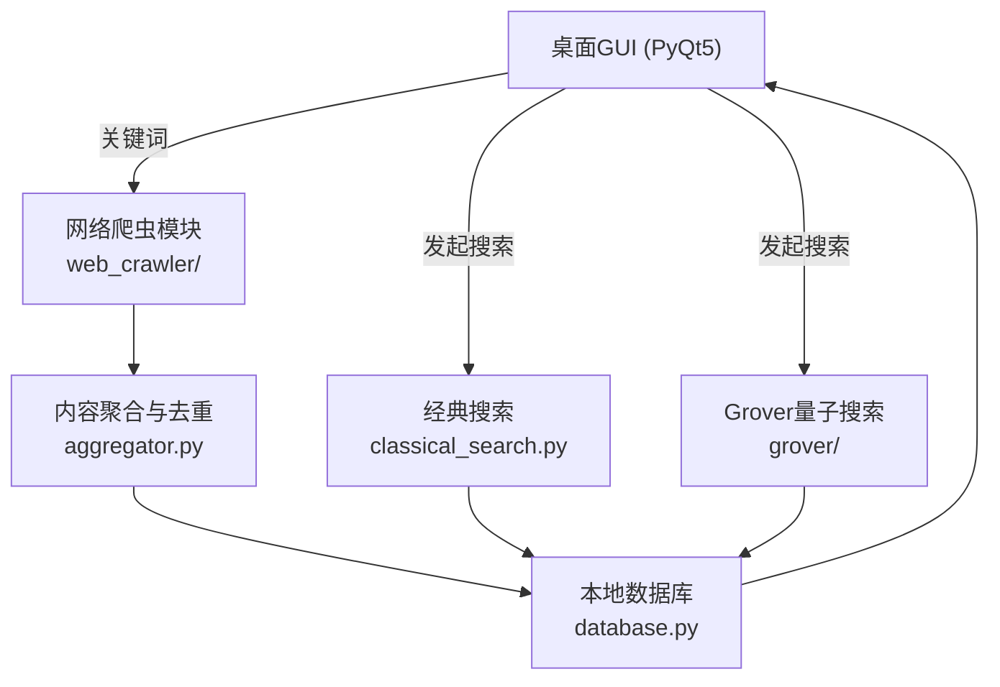
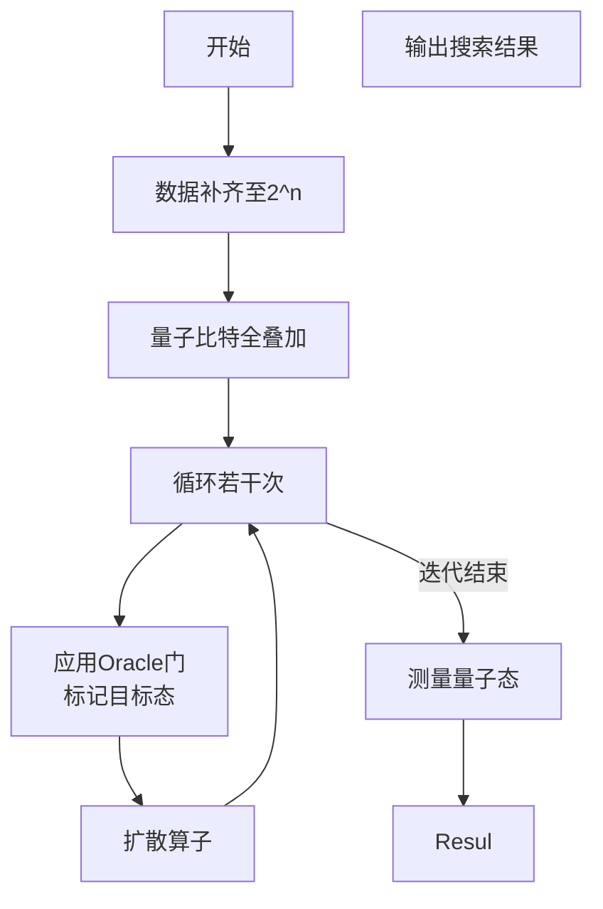
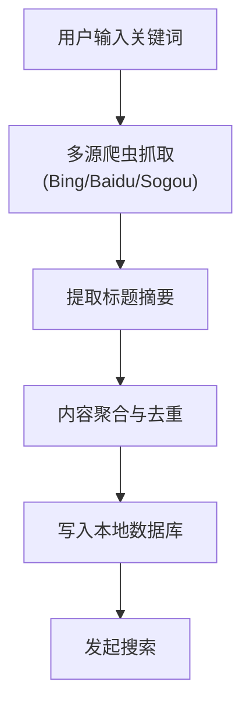

# `<center>` 目录

- 摘要
- 关键词
- 一、项目背景与意义
- 二、项目目标与功能
- 三、相关技术概述
- 四、系统架构与模块设计
- 五、Grover算法核心实现
- 六、主要功能演示
- 七、实验与对比分析
- 八、总结
- 参考文献

# `<center>`内容

## 摘要

随着数据量的爆炸式增长，高效的搜索技术成为信息检索领域的重要研究方向。量子计算作为新兴技术，在搜索问题上展现出独特的潜力。Grover算法作为量子计算中最具代表性的无序数据库搜索算法，理论上能以$O(\sqrt{N})$ 的复杂度在 $N$ 个元素中定位目标，相比经典线性搜索的 $O(N)$ 复杂度具备显著优势。

本项目基于Grover算法，设计并实现了一套集网络内容聚合、本地无序数据库管理、量子搜索与经典搜索对比、图形界面展示于一体的综合性系统。系统采用Qiskit作为量子电路模拟工具，PyQt5作为前端开发框架，辅以多源爬虫模块自动构建搜索数据库。通过实验验证，量子搜索在中小规模数据集下能显著降低搜索轮数，验证了Grover算法的理论优势与工程可行性。

本项目具有良好的工程实践意义与科普推广价值，为量子计算技术在实际应用领域的探索提供了参考。

## 关键词

Grover算法；量子计算；无序数据库；搜索算法；Qiskit；PyQt5

## 一、项目背景与意义

&emsp;&emsp;在大数据时代，信息检索技术面临前所未有的挑战。传统的搜索算法，在数据规模剧增时效率逐渐下降。同时，海量数据存在无序、噪声多、变化快等特点，增加了搜索与聚合的复杂性。

量子计算作为下一代计算范式，利用量子叠加、纠缠等特性，有望在特定问题上实现指数级加速。Grover提出的无序数据库搜索算法，能够在 $O(\sqrt{N})$ 步内找到目标项，为解决大规模无序搜索问题提供了理论支撑。

- **理论意义**
  验证Grover算法的实际效果与工程实现路径，探索量子搜索与经典搜索在不同数据规模下的性能差异。
- **应用意义**
  结合实际网络数据，构建近似真实环境下的无序数据库，提供易用的搜索系统原型。
- **科普价值**
  降低量子计算学习门槛，提升大众对量子技术的认知。

## 二、项目目标与功能

- 实现Grover量子搜索算法的仿真与可视化
- 支持经典线性搜索与量子搜索效果对比
- 自动聚合网络内容，构建本地无序数据库
- 提供易用的桌面GUI界面，支持关键词抓取、目标搜索、结果展示与算法细节可视化
- 强调Grover算法核心原理与工程实现

## 三、相关技术概述

### 1. 量子计算简介

量子计算基于量子力学基本原理，使用量子比特（qubit）进行信息处理。相较于传统比特仅能取0或1，量子比特可以处于叠加态，从而具有天然的并行处理能力。

### 2. Grover搜索算法原理

Grover算法基本流程：

1. 初始化均匀叠加态；
2. 通过Oracle门标记目标态；
3. 应用扩散算子放大目标态概率；
4. 重复约 $O(\sqrt{N})$ 次；
5. 测量获取结果。

### 3. 经典线性搜索概述

经典线性搜索遍历数据库中的每一项，时间复杂度为$O(N)$。

## 四、系统架构与模块设计

- **grover/**：Grover算法主逻辑与Oracle门实现
- **classical_search.py**：经典线性搜索算法
- **web_crawler/**：多源网络爬虫与内容聚合
- **database.py**：本地无序数据库管理
- **gui/**：PyQt5桌面GUI界面
- **main.py**：项目入口，仅支持GUI启动

&emsp;&emsp;模块间通过清晰接口协作，保证量子搜索流程的可扩展性与可维护性。

### 系统架构图



上述架构图清晰展示了用户界面、爬虫、聚合、数据库、经典与量子搜索模块的协作流程。

## 五、Grover算法核心实现

在本项目中，Grover主流程负责搭建量子搜索算法的核心电路，整体流程包括数据补齐、量子叠加初始化、Oracle门构造、扩散算子应用、迭代执行、最终测量与仿真输出。每个环节相辅相成，共同实现对目标数据的高效量子搜索。

### 1. 量子电路构建与Grover主流程

&emsp;&emsp;Grover主流程包括：数据补齐、量子叠加、Oracle门、扩散算子、测量与仿真。

#### Grover算法流程图



* **数据补齐**确保数据规模满足 2n2^n**2**n 要求，便于量子比特编码；
* **量子叠加**构建初态，使所有可能解均匀分布；
* **Oracle门**用于标记目标态，改变其相位；
* **扩散算子** （Diffusion）进一步增强目标态的振幅；
* **循环迭代**根据理论推导的最优次数；
* **最终测量**输出出现概率最大的结果。

上述流程图直观展现了Grover算法的量子电路构建与主流程。

```python
# grover/grover_core.py
from qiskit import QuantumCircuit, transpile
from qiskit.providers.aer import Aer
import numpy as np

def grover_search(database, target, shots=1024):
    n = int(np.ceil(np.log2(len(database))))
    N = 2 ** n
    pad_db = list(database) + [None] * (N - len(database))
    idx = pad_db.index(target)
    # 1. 初始化叠加
    qc = QuantumCircuit(n, n)
    qc.h(range(n))
    # 2. Oracle门
    bin_str = f"{{:0{n}b}}".format(idx)
    oracle = create_oracle(n, [int(b) for b in bin_str])
    # 3. Grover迭代
    iterations = int(np.floor(np.pi/4 * np.sqrt(N)))
    for _ in range(iterations):
        qc.append(oracle.to_gate(), range(n))
        qc.append(diffusion(n).to_gate(), range(n))
    # 4. 测量与仿真
    qc.measure(range(n), range(n))
    backend = Aer.get_backend('qasm_simulator')
    tqc = transpile(qc, backend)
    job = backend.run(tqc, shots=shots)
    result = job.result()
    counts = result.get_counts()
    max_state = max(counts, key=counts.get)
    found_idx = int(max_state, 2)
    found = pad_db[found_idx]
    return found, counts
```

主流程封装了整个Grover搜索，从数据预处理到量子电路搭建，再到最终结果提取，形成了高度模块化的一体化实现。

### 2. Oracle门自动生成

&emsp;&emsp;Oracle门是Grover算法的关键组件之一，用于通过相位反转标记目标态。该模块支持根据任意输入的比特串，自动生成对应的Oracle电路。

```python
# grover/oracle.py
from qiskit import QuantumCircuit

def create_oracle(n_qubits, target_state):
    oracle = QuantumCircuit(n_qubits)
    for i, bit in enumerate(target_state):
        if bit == 0:
            oracle.x(i)
    if n_qubits == 1:
        oracle.z(0)
    else:
        oracle.h(n_qubits-1)
        oracle.mcx(list(range(n_qubits-1)), n_qubits-1)
        oracle.h(n_qubits-1)
    for i, bit in enumerate(target_state):
        if bit == 0:
            oracle.x(i)
    oracle.name = "Oracle"
    return oracle
```

Oracle门采用了标准化、多控门（MCX）构建方式，确保了高扩展性和对任意目标态的兼容性。

### 3. 扩散算子（幅度放大）

扩散算子负责增强目标态的概率振幅。数学上，相当于对所有态进行关于平均值的反射。

```python
# grover/grover_core.py
from qiskit import QuantumCircuit

def diffusion(n):
    circ = QuantumCircuit(n)
    circ.h(range(n))
    circ.x(range(n))
    circ.h(n-1)
    circ.mcx(list(range(n-1)), n-1)
    circ.h(n-1)
    circ.x(range(n))
    circ.h(range(n))
    circ.name = "Diffusion"
    return circ
```

扩散算子和Oracle门结合，形成了Grover迭代的基本单元，实现对目标态振幅的指数级放大。

### 4. 经典线性搜索对比

为体现Grover算法相较经典方法的加速优势，项目实现了一个简单的经典线性搜索函数。

```python
# classical_search.py
from typing import List, Any

def classical_linear_search(database: List[Any], target: Any) -> int:
    for idx, item in enumerate(database):
        if item == target:
            return idx
    return -1
```

Grover搜索在理想情况下能将搜索复杂度从𝑂(𝑁)O(N) 降至 𝑂(𝑁)$O(\sqrt{N})$ ，与经典线性搜索形成鲜明对比。

### 5. 聚合与去重逻辑

针对数据来源不确定、冗余度高的问题，项目提供了聚合与去重工具，确保数据预处理后的唯一性和规范性。

```python
# web_crawler/aggregator.py
def aggregate_and_deduplicate(data):
    seen = set()
    unique_data = []
    for item in data:
        key = (item.get('title', ''), item.get('url', ''))
        if key not in seen:
            seen.add(key)
            unique_data.append(item)
    return unique_data
```

简单高效的哈希去重方式，保证后续量子搜索的数据质量与有效性。

&emsp;总结:  通过上述模块的有机配合，项目实现了从数据采集、清洗，到量子电路构建与搜索执行的完整工程闭环。每个模块独立封装，便于维护与拓展，同时所有量子电路均支持可视化展示，进一步提升了Grover算法的可理解性与可用性

## 六、主要功能演示

### 网络爬虫与聚合流程图



上述流程图描述了用户如何通过关键词驱动网络爬虫，聚合内容并写入本地数据库，为后续搜索提供数据基础。

- **关键词抓取**：输入关键词，自动聚合Bing、百度、搜狗等多源内容，去重后存入本地数据库。

<div align="center">
  
  <br><em>关键词抓取</em>
</div>

- **目标搜索**：输入目标内容，选择经典或Grover搜索，点击“搜索”即可获得结果。

<div align="center">
  
  <br><em>经典搜索</em>
</div>

<div align="center">
  
  <br><em>量子搜索</em>
</div>

- **详情介绍**：可一键查看Grover量子电路结构与测量分布，便于理解算法原理。

<div align="center">
  
  <br><em>详情介绍</em>
</div>

- **数据库**：展示本地数据库内容，支持关键词抓取。

<div align="center">
  
  <br><em>数据库</em>
</div>

## 七、实验与对比分析

- **经典vs量子搜索**：

  - 经典线性搜索复杂度O(N)，Grover量子搜索复杂度O(√N)。
  - 例如：在100条数据中查找目标，经典平均需查50次，Grover理论上约需10次迭代。
  - 实验结果：

    

    如上图所示，Grover算法在100条数据中搜索目标时，经过约10次迭代后，目标态的概率显著高于其他状态，体现了量子幅度放大的效果。
- **网络聚合效果**：

  - 多源爬虫（Bing、百度、搜狗）自动抓取并去重，数据库内容丰富。
  - 关键实现：
    ```python
    all_data = multi_source_crawl(keyword)
    agg_data = aggregate_and_deduplicate(all_data)
    db.add_items(agg_data)
    ```
  - 确保数据唯一性和高质量。
- **用户体验**：

  - GUI界面支持一键抓取、搜索、可视化。
  - 量子搜索详情窗口可展示电路结构与概率分布直方图。
  - 参数校验健壮，防止异常输入。

## 八、总结

&emsp;&emsp;本项目以Grover算法为核心，完整实现了量子无序数据库搜索的仿真流程，并结合网络内容聚合、经典对比与可视化，适合量子计算学习、科普与工程实践。

&emsp;&emsp;在开发过程中，团队经历了从理论算法梳理到工程实现的多轮迭代。最初在量子电路构建和Oracle门自动生成时，遇到了多比特目标态的门控设计难题，经过查阅Qiskit文档与大量实验，最终实现了可扩展的多控门自动生成逻辑。为兼顾易用性与功能性，前端采用PyQt5重构了界面，调整窗口布局与字体，提升了用户体验。

&emsp;&emsp;在Web聚合与数据抓取部分，实际运行中遇到反爬机制和编码兼容性问题。通过动态调整请求头、增加异常处理和数据去重，保证了数据抓取的稳定性和数据库的高质量。

&emsp;&emsp;此外，团队还注重代码结构优化和模块解耦，反复清理冗余代码，完善参数校验，确保主流程健壮可维护。多次对比经典与量子搜索的实验结果，结合可视化直方图，直观展现了Grover算法的优势。

&emsp;&emsp;本项目开发过程中，团队成员积极协作、持续学习，克服了量子仿真、界面交互、数据聚合等多方面挑战，最终实现了理论与工程实践的有机结合。

成果总结：

* 实现Grover搜索仿真；
* 经典搜索与量子搜索对比；
* 网络聚合与数据库建设；
* 可视化交互界面。

存在问题：

* 仿真器开销较大；
* 爬虫模块受限于反爬机制；
* GUI大规模数据下需进一步优化。

未来展望：

* 部署实际量子硬件；
* 引入智能排序与数据增强技术；
* 探索其他量子加速算法。

---

# 参考文献

[1] Grover L K. A Fast Quantum Mechanical Algorithm for Database Search. Proceedings of the 28th Annual ACM Symposium on Theory of Computing, 1996.

[2] Nielsen M A, Chuang I L. Quantum Computation and Quantum Information. Cambridge University Press, 2000.

[3] Qiskit Official Documentation: [https://qiskit.org/documentation/]()
